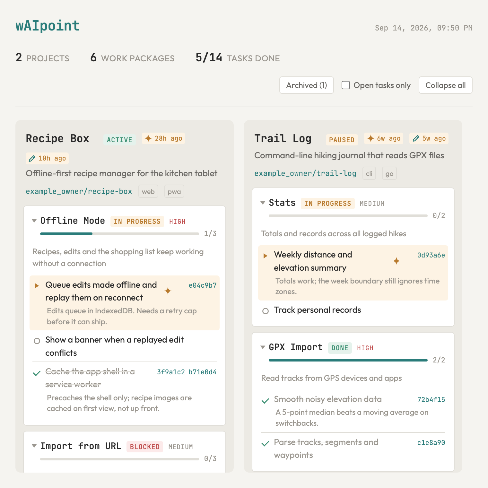

# wAIpoint

A lightweight project tracker for LLM coding agents. Your roadmap lives as JSON
files in a private GitHub repo, and agents post updates to it with a small CLI —
no server, no database, and no copy of the tracker inside every project.

<a href="https://jaronimoe.github.io/wAIpoint/">
  <picture>
    <source media="(prefers-color-scheme: dark)" srcset=".github/readme/dashboard-dark.png">
    
  </picture>
</a>

**[Open the live demo board](https://jaronimoe.github.io/wAIpoint/)**, built from
the invented projects in `examples/`.

## How it works

Two repos are involved:

- **This repo, the tool** — the `waipoint` CLI, an agent skill, a pi extension,
  a Claude Code hook, and a dashboard.
- **Your data repo** — a private repo that holds nothing but your projects:

```
waipoint-data.json            # marks the repo as a wAIpoint data repo
projects/
  my-app/
    project.json              # project metadata
    wp-auth/
      workpackage.json        # work package metadata
      tasks/
        implement-oauth.json  # one file per task
        add-tests.json
```

Agents working in your project repos call `waipoint`, which reads and writes the
data repo through the GitHub API. Nothing gets cloned: `waipoint update-task`
reads one small JSON file, changes a field, and writes it back as a commit. So
every change is in the history, with a clear message, for free.

To see a board before setting anything up, open the
[demo board](https://jaronimoe.github.io/wAIpoint/). To build the same board
yourself, run this and open `dist/demo.html` in a browser:

```bash
mkdir -p dist
scripts/build-dashboard.sh examples/projects docs/index.html dist/demo.html
```

## Quick start

You need an authenticated [`gh`](https://cli.github.com) (GitHub CLI), plus
`jq`, `python3` and `tar` — all present by default on macOS and most Linux
distributions.

**On Windows**, run everything inside
[WSL](https://learn.microsoft.com/windows/wsl/install): the CLI and the
installer are bash scripts, so they do not run in PowerShell or cmd. Install
your agent harness inside WSL as well — one installed on Windows itself cannot
run a `waipoint` that lives in WSL — and keep your clone in the Linux home
directory rather than under `/mnt/c`. Git Bash is not a good substitute: it can
turn the installer's symlinks into copies, which then stop updating on
`git pull`.

### 1. Install

```bash
git clone https://github.com/jaronimoe/wAIpoint.git
cd wAIpoint
./scripts/install.sh
```

`install.sh` links the CLI into `~/.local/bin`, without `sudo`, and offers to put
that directory on your `PATH` if it is missing (`--bin-dir` picks another).
Then it sets up each agent harness it finds:

- **pi**: the skill into `~/.agents/skills` and the extension into
  `~/.pi/agent/extensions`.
- **Claude Code**: the skill into `~/.claude/skills` and, once you agree, the
  status hook into `~/.claude/settings.json` and a tracking section into
  `~/.claude/CLAUDE.md`. It backs both files up first.

Every piece is a symlink into your clone, so `git pull` is how you update, and
running `install.sh` again is safe. `--yes` agrees to every edit; without a
terminal it edits no config file and prints what to add instead.

### 2. Create your data repo

```bash
waipoint init
```

This creates a private repo named `<your-user>/waipoint-data`, marks it as a
wAIpoint data repo, and points `~/.config/waipoint/config` at it. It asks before
creating the repo; `--yes` skips the question.

If you already have a data repo — set up on another machine, or under another
name — connect to it instead:

```bash
waipoint init --repo <owner>/<name>
```

Running `init` again is safe: when the config already points at a data repo, it
says so and changes nothing.

The marker is a file at the root of the data repo, `waipoint-data.json`. The CLI
checks for it before every write and refuses to write anywhere without it, so a
mistyped repo name fails loudly instead of creating files in some other repo.
For the same reason, `init` only marks a repo it created or one that is still
empty. Your project repos never need it — the CLI does not write to them.

### 3. Track a project

In a repo you want tracked, ask your agent to set up wAIpoint tracking. The
skill looks at the repo, proposes a structure, and asks you before it creates
anything. Or create the project yourself:

```bash
waipoint init-project my-app \
  --name "My App" \
  --repo <your-user>/my-app \
  --description "A cool project" \
  --tags frontend,react

waipoint init-wp my-app wp-auth \
  --name "Authentication" \
  --description "User login and session management" \
  --priority high

waipoint add-task my-app wp-auth implement-oauth \
  --name "Implement OAuth flow"
```

Use the repo's name, lowercased, as the project slug. That is how agents find
the project from inside the repo: they take the last segment of its `origin`
URL and lowercase it.

### 4. Let agents update it

With the skill installed (see [Agent integration](#agent-integration)), agents
make these calls themselves as they work:

```bash
# Mark a task as in progress
waipoint update-task my-app wp-auth implement-oauth --status current

# Mark it done with a commit link
waipoint update-task my-app wp-auth implement-oauth \
  --status done \
  --commit https://github.com/<your-user>/my-app/commit/abc1234

# Move a work package along
waipoint update-wp my-app wp-auth --status in-progress

# Record what a work package waits on, and why (this also sets it to blocked)
waipoint update-wp my-app wp-auth --blocked-by wp-api \
  --notes "Needs the session endpoint from wp-api"
```

## Agent integration

The **skill** tells any agent harness when and how to call the CLI. The **pi
extension** and the **Claude Code hook** add guardrails on top of it; the skill
works without them.

### Skill

`skills/waipoint/` covers three situations:

| Case | When | What the skill does |
|------|------|---------------------|
| **1 — Existing repo with history** | `show <slug>` finds nothing; the repo has a README, roadmap or git history | Mine the docs and git log, propose a structure, confirm before creating anything |
| **2 — New repo** | `show <slug>` finds nothing; the repo is new or empty | `init-project` only, then build the roadmap as the user defines scope |
| **3 — Already tracked** | `show <slug>` finds the project | Steady state: `current` and `done` updates as work happens |

Its rules keep agents from inventing work: direction comes from the user,
projects and tasks are only created when the user asks, and when the CLI refuses
to run — no repo configured, no marker — the agent reports it instead of working
around it.

When it finds pi, or that directory already exists, `install.sh` links the skill
into `~/.agents/skills`, a shared discovery path. In pi you can list the
directory in `settings.json` instead:

```json
{ "skills": ["/path/to/wAIpoint/skills"] }
```

### Claude Code

Three pieces, all in `~/.claude/`. When `install.sh` finds Claude Code it sets
up all three, asking before it edits `settings.json` or `CLAUDE.md`. To do it by
hand instead:

**1. Skill** — link the skill directory:

```bash
mkdir -p ~/.claude/skills
ln -sfn /path/to/wAIpoint/skills/waipoint ~/.claude/skills/waipoint
```

That makes `/waipoint` available in every session. Link rather than copy, so a
`git pull` updates it and the two cannot drift apart.

**2. Status hook** — register the validation script in `~/.claude/settings.json`:

```json
{
  "hooks": {
    "PreToolUse": [
      {
        "matcher": "Bash",
        "hooks": [
          {
            "type": "command",
            "command": "/path/to/wAIpoint/scripts/claude-hook-validate-status.sh"
          }
        ]
      }
    ]
  }
}
```

It checks `--status` on `waipoint update-*` commands before they run, blocks
invalid values, and tells the agent which values are valid.

**3. Global instructions** — append
[`scripts/claude-md-section.md`](scripts/claude-md-section.md) to
`~/.claude/CLAUDE.md`. It has the agent run `waipoint show` at session start and
record finished work against the matching task:

```bash
cat /path/to/wAIpoint/scripts/claude-md-section.md >> ~/.claude/CLAUDE.md
```

### Pi extension

`extensions/waipoint.ts` adds, in pi sessions:

- **A status widget** — at session start it derives the project slug from
  `git remote`, runs `show`, and displays a task count. It costs no context
  tokens.
- **A tracking hint** — on the first turn of a tracked project, a hidden
  message tells the agent how to record finished work.
- **Status validation** — blocks `waipoint update-*` calls with an invalid
  `--status` before they run.
- **Commit follow-up** — when a `git commit` isn't followed by an
  `update-task`, a notice says the commit wasn't matched to a task.

When it finds pi, `install.sh` links it into `~/.pi/agent/extensions`. You can
also list it in pi's `settings.json`:

```json
{ "extensions": ["/path/to/wAIpoint/extensions/waipoint.ts"] }
```

### Without the skill

To track a single project without installing the skill, add this to its
`CLAUDE.md` or `AGENTS.md`:

```markdown
## Project Tracking
This project is tracked as `my-app` in wAIpoint.
When completing significant work, run:
  waipoint update-task my-app <wp-slug> <task-slug> --status done --commit <commit-url>
If starting a new task, run:
  waipoint update-task my-app <wp-slug> <task-slug> --status current
```

Keep it that short. Don't tell agents to read the tracker at session start to
decide what to do — direction should come from you.

## Dashboard

### Build it locally

```bash
waipoint dashboard --open
```

This downloads your data repo as one tarball and renders it with the template
from your install. The result is cached against both your data and your install,
so running it again with nothing changed costs one API call. `--force` rebuilds
anyway.

A local build is a read-only snapshot. Editing from the page needs the hosted
version — see [Hosting on Cloudflare](#hosting-on-cloudflare).

### Reading the board

Three controls shape what the board shows. Each one is remembered per browser,
so the view survives a reload and the next redeploy:

- **Collapse a work package** by clicking its header. The status badge and the
  progress bar stay in the header, so a folded card still reports where it
  stands. **Collapse all** folds every card in one go, then flips to **Expand
  all**.
- **Open tasks only** hides done and dropped tasks. A work package with nothing
  left open says `No open tasks` rather than showing an empty list.
- **The spark** marks the task an agent updated most recently in each project —
  the project header carries it with an age (`4d ago`), and the task itself is
  highlighted. A collapsed work package keeps the spark, so the trail still
  points at where the update landed. It reads `updated`, which only the CLI
  sets.
- **The pencil** does the same for the most recent manual edit made in the
  dashboard, which can land on a task, a work package or the project itself. It
  reads `edited`, which only the dashboard sets — see
  [Edit from the dashboard](#edit-from-the-dashboard).

### Focus a single project

Click a project header to drop the other columns and give that project the full
width. The URL gains the project slug (`…/#my-app`), so a focused project is
linkable and bookmarkable. Back returns to the board, and so do Esc and
**← All projects**. The collapse and open-only controls keep working inside it.

The extra width buys four things a 340px column has no room for:

- **An overview strip** — every task as one bar (done / in progress / open /
  dropped), the work-package states beside it, and the project's start, last
  agent update and last manual edit. Task `updated` stamps drive the agent
  date: `project.json` only records its own last write, so it goes stale while
  the tasks move.
- **Needs attention** — blocked work packages (naming the blocker when
  `blocked_by` is set, with their notes), tasks marked `current`, and
  high-priority work packages that still have open tasks. Nothing to flag
  means no panel.
- **Recent updates** — every task by `updated`, plus every manual edit (marked
  with the pencil) to a task, a work package or the project by `edited`, newest
  first, grouped by day. It shows when a record was last written and where it
  stands now, which is not the same as when it changed status.
- **Commits** — every commit URL the project has collected, grouped under its
  task. Ordered by the task's last write, since commit dates are not stored.

Clicking a row in any panel opens its work package and scrolls to it.

### Archived projects

The board lists active projects first, then paused, then completed. Within each
group the most recently touched project comes first: the newest agent update or
manual edit anywhere in it, whether to the project, a work package or a task.
Archived projects are left off the board and out of its counts. When there are
any, **Archived (N)** opens them, in the same order, as a board of their own
(`…/#:archived`), and **← All projects** returns. A project opened from there
leads back to the archive. Archiving a project from the dashboard moves it
there as soon as the edit saves.

### Edit from the dashboard

The hosted dashboard is not read-only. Each project header carries a `+` that
creates a work package, and each work package a `+` that adds a task to it. The
form derives a slug from the name and shows the file path it will write, since
the slug is permanent — it is what you type into the CLI afterwards.

Existing records change in place: click a project's or a work package's status
badge, a work package's priority, or a task's status icon, and pick a value.

Every write commits the JSON straight to your data repo through the Git Data
API, so it lands as a single commit, attributed to whoever is signed in:

```
update wp: my-app/wp-auth

status: planned -> in-progress
via dashboard by you@example.com
```

An edit sends only the field that changed. The Worker applies it to the file as
it stands at the commit it builds on, not to the page's copy, which dates from
the last deploy — so nothing an agent wrote since then gets reverted, and the
page takes the fresh record back without waiting for the redeploy. Picking the
value a record already has commits nothing. Moving a work package off `blocked`
also clears its `blocked_by`, as the CLI does.

The commit is unforced, so an agent writing through the CLI at the same moment
wins and the dashboard retries against the new head rather than overwriting it.

Dashboard writes stamp `edited` and never touch `updated`, which only the CLI
sets. That split is what lets the board mark agent updates (the spark) and
manual edits (the pencil) separately. It is a split by path, not by person:
running the CLI yourself counts as an agent update.

**Access is the whole permission model.** Anyone who gets through the
Cloudflare Access policy can create work packages and tasks and change the
status or priority of any record. Only let in people you would give write
access to the data repo.

The `+` buttons and the editors only appear when the write API answers, so a
locally built copy stays a read-only snapshot. `docs/index.html` is the
template, not a build output — opening it directly shows an empty board.

## Hosting on Cloudflare

The hosted dashboard runs as a Cloudflare Worker. A short workflow in your data
repo rebuilds and deploys it on every data change, using the deploy action in
this repo. Both sides sit inside free tiers.

Two tokens are involved, pointing in opposite directions:

- a **Cloudflare token**, stored in GitHub, so CI can deploy the Worker
- a **GitHub token**, stored in Cloudflare, so the Worker can commit back

Order matters. A Worker that has only static assets cannot hold variables, so
the GitHub token can only be added *after* the first real deploy.

**1. Create the Worker.** Workers & Pages → Create → upload any placeholder
`index.html`, and set the Worker name to `waipoint`. That is the deploy action's
default; if you choose another name, pass it as `worker-name` in step 4. A
mismatch creates a second, ungated Worker instead of updating this one. Deploy. Nothing sensitive goes up; the placeholder exists
only so the Worker exists.

**2. Gate it before real data lands.** Zero Trust → Access → Policies → add a
policy with selector **Emails** and your address, action Allow. Then Workers &
Pages → waipoint → **Access** → Scope **All traffic**, pick that policy,
Apply. The scope matters: "All traffic" covers the `workers.dev` hostname
itself, where "Previews only" does not.

Verify from outside before going further:

```bash
curl -s -o /dev/null -w '%{http_code}\n' https://waipoint.<subdomain>.workers.dev/
# 302 → gated. 200 → not gated; fix this before deploying real data.
```

**3. Cloudflare token into GitHub.** My Profile → API Tokens → Create Token →
Custom token, with exactly:

| Scope | Permission | Level |
|-------|------------|-------|
| Account | Workers Scripts | Edit |
| Account | Account Settings | Read |

The "Edit Cloudflare Workers" template also grants Edit on R2, KV, Pages and
Containers, which this deploy never needs. Under Account Resources include your
account, and leave Client IP filtering empty — GitHub's runners have their own
addresses.

Then in your data repo: Settings → Secrets and variables → Actions, and add
`CLOUDFLARE_API_TOKEN` plus `CLOUDFLARE_ACCOUNT_ID`. The account ID is the first
path segment of any dashboard URL: `dash.cloudflare.com/<account-id>/...`.

**4. Add the deploy workflow.** In your data repo, create
`.github/workflows/dashboard.yml`:

```yaml
name: Deploy Dashboard

on:
  push:
    branches: [main]
    paths:
      - 'projects/**'
      - '.github/workflows/dashboard.yml'
  workflow_dispatch:

# Agents write in bursts, one commit per file, so keep only the latest run.
concurrency:
  group: dashboard-deploy
  cancel-in-progress: true

permissions:
  contents: read

jobs:
  deploy:
    runs-on: ubuntu-latest
    steps:
      - uses: actions/checkout@v4
      - uses: jaronimoe/wAIpoint@v0.3.0
        with:
          cloudflare-api-token: ${{ secrets.CLOUDFLARE_API_TOKEN }}
          cloudflare-account-id: ${{ secrets.CLOUDFLARE_ACCOUNT_ID }}
```

Push it. The workflow builds the page from your `projects/` and deploys over
the placeholder, pointing the Worker's write API at your data repo. The
dashboard is live behind the PIN prompt at this point, but read-only: the `+`
buttons stay hidden because the write API reports itself unready.

**5. GitHub token into Cloudflare.** Now that the Worker has a script, its
Settings → Variables and Secrets page works. Create a **fine-grained** token at
`github.com/settings/personal-access-tokens/new`:

- Repository access: **Only select repositories** → your data repo
- Repository permissions: **Contents: Read and write**, nothing else

Add it to the Worker as **Type: Secret**, named `GITHUB_TOKEN`. It has to be a
secret rather than a plain variable: `wrangler deploy` replaces the plain
variable set with whatever `wrangler.jsonc` declares, which would wipe a
variable of that name on the next deploy. Secrets are stored separately and
survive.

Reload the dashboard. The `+` buttons appearing is the confirmation that the
token took.

### Updating

The tag in `uses: jaronimoe/wAIpoint@v0.3.0` is the version your dashboard runs.
A new wAIpoint release changes nothing on your Worker until you bump that tag —
a one-line commit in your data repo, and just as easy to revert.

### Troubleshooting

| Symptom | Cause |
|---------|-------|
| `Variables cannot be added to a Worker that only has static assets` | The Worker has no script yet. Deploy once, then add the secret. |
| No `+` buttons on the hosted page | `GITHUB_TOKEN` is not reaching the Worker. The readiness probe returns 503 and the page hides the controls by design. |
| Writes fail with `unauthenticated (...)` | Access did not supply an identity. The message names which source came up empty. |
| Many cancelled workflow runs | Expected. A burst of CLI writes triggers a run each; the `concurrency` group keeps only the last. |

## Reference

### CLI

| Command | Description |
|---------|-------------|
| `init` | Create or connect your data repo and point the config at it (`--repo`, `--yes`) |
| `init-project <slug>` | Create a project |
| `update-project <slug>` | Update project status or description |
| `init-wp <project> <wp>` | Create a work package |
| `update-wp <project> <wp>` | Update a work package's status, priority, description or notes, or record what blocks it |
| `add-task <project> <wp> <task>` | Add a task |
| `update-task <project> <wp> <task>` | Update a task's status, append a commit, set notes |
| `list` | List all projects |
| `show <project>` | Show a project with its work packages and tasks |
| `dashboard [file]` | Build the HTML dashboard (`--open` to launch it, `--force` to skip the cache) |

`waipoint help` prints every option.

### Statuses

| Level | Values |
|-------|--------|
| Project | `active`, `paused`, `completed`, `archived` |
| Work package | `planned`, `in-progress`, `blocked`, `done` |
| Task | `open`, `current`, `done`, `dropped` |

Work packages also carry a priority: `low`, `medium` or `high`.

### Configuration

| Setting | Where | Purpose |
|---------|-------|---------|
| `repo=<owner>/<name>` | `~/.config/waipoint/config` | The data repo the CLI reads and writes |
| `WAIPOINT_REPO` | environment | Overrides `repo=` |
| `waipoint-data.json` | root of the data repo | Marks a data repo; the CLI refuses to write without it |

`waipoint init` writes the `repo=` line. There is no default: with neither
setting, every command but `init` stops and says so. The CLI follows the data
repo's default branch, but the hosted dashboard commits to `main`, which is the
branch `init` creates.

The hosted dashboard is configured in three places:

| Setting | Kind | Set in | Purpose |
|---------|------|--------|---------|
| `GITHUB_TOKEN` | Worker secret | Cloudflare dashboard | Lets the Worker commit to your data repo |
| `CLOUDFLARE_API_TOKEN` | Actions secret | data repo settings | Lets the workflow deploy the Worker |
| `CLOUDFLARE_ACCOUNT_ID` | Actions secret | data repo settings | Which Cloudflare account to deploy into |

The deploy action takes these inputs:

| Input | Default | Purpose |
|-------|---------|---------|
| `cloudflare-api-token` | required | Pass `secrets.CLOUDFLARE_API_TOKEN` |
| `cloudflare-account-id` | required | Pass `secrets.CLOUDFLARE_ACCOUNT_ID` |
| `worker-name` | `waipoint` | The Worker to deploy to |
| `tracker-repo` | the repo running the workflow | Set as the Worker's `TRACKER_REPO`: where dashboard edits are committed |
| `projects-dir` | `projects` | Where the projects live in the data repo |

`wrangler.jsonc` in this repo is the base config every deployment shares; the
action sets the Worker name and `TRACKER_REPO` on top of it.

### Repo layout

```
wAIpoint/
├── scripts/
│   ├── waipoint                        # CLI (bash)
│   ├── build-dashboard.sh              # Build wrapper
│   ├── build-dashboard.py              # Splices project data into the template
│   ├── install.sh                      # Links the CLI; sets up pi and Claude Code
│   ├── claude-hook-validate-status.sh  # Claude Code PreToolUse hook
│   └── claude-md-section.md            # Tracking section for ~/.claude/CLAUDE.md
├── skills/waipoint/                    # Agent skill: SKILL.md + case references
├── extensions/waipoint.ts              # Pi extension
├── docs/index.html                     # Dashboard template (data spliced in at build)
├── src/index.js                        # Worker: serves the page, handles writes
├── schema/                             # JSON schemas for project, work package, task
├── examples/projects/                  # Invented demo data
├── action.yml                          # Deploy action your data repo's workflow calls
└── wrangler.jsonc                      # Base Worker config the action deploys with
```

## Design principles

- **Direction comes from the user, not the tracker.** Agents don't read project
  state to decide what to do — you tell them. The tracker is a status board.
- **Minimal token overhead.** Agents write targeted updates to individual task
  files, with no need to load the full project state.
- **Git as the database.** Every update is a commit with a clear message. Full
  history for free.
- **No infrastructure required.** The CLI needs only `gh` and a GitHub repo. The
  hosted dashboard is optional — without it, `waipoint dashboard --open` builds
  the same page locally.

## License

MIT — see [LICENSE](LICENSE). The dashboard embeds JetBrains Mono and Outfit,
both under the SIL Open Font License 1.1; their copyright notices are in
`docs/index.html`.
